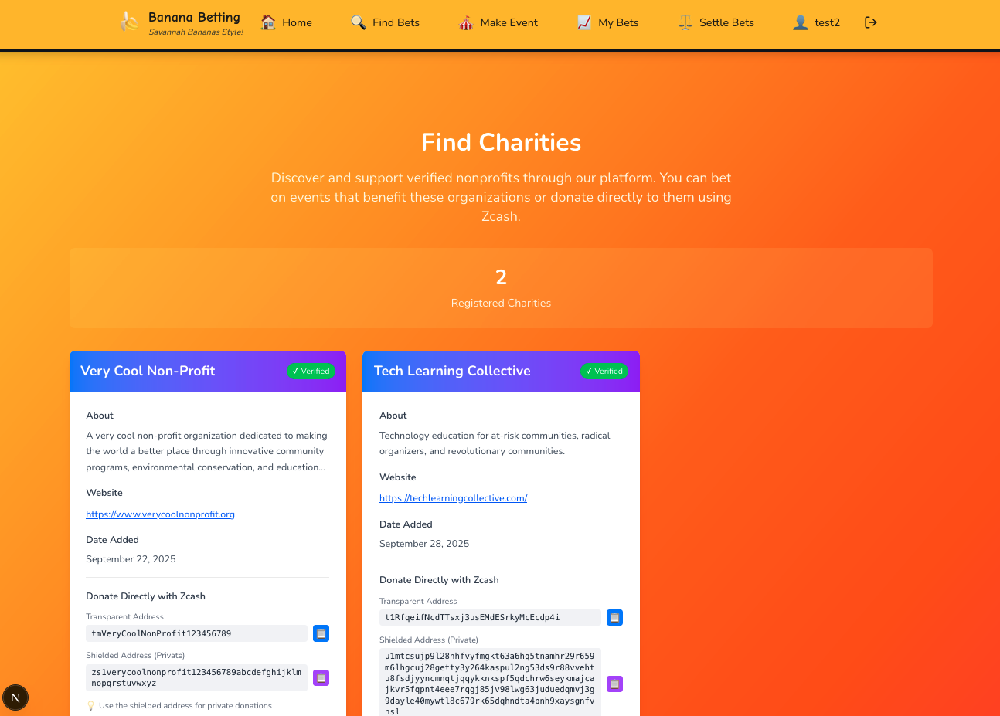
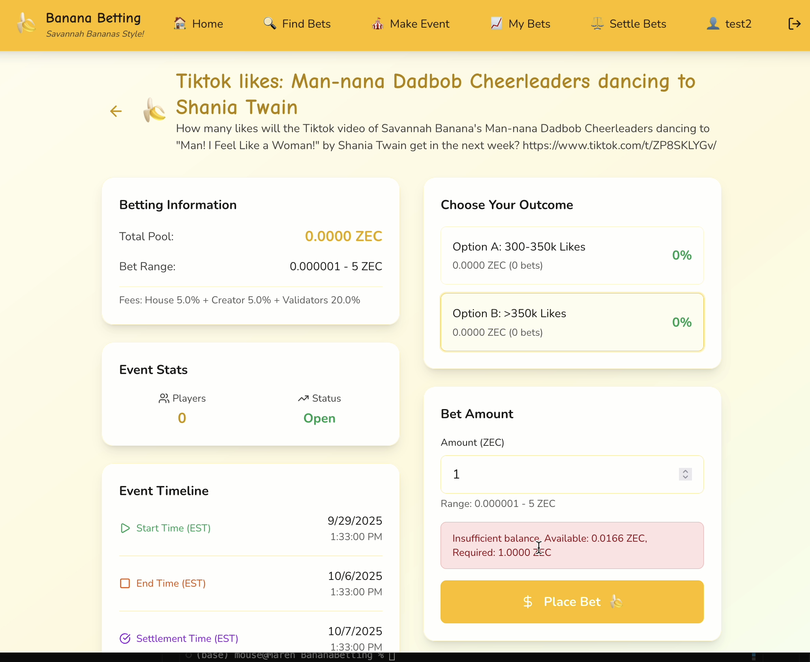

# A Step-by-Step Demostration of Capbilities 

**⚠️ IMPORTANT DISCLAIMER ⚠️**
This project was created for the [**2025 ZecHub Hackathon**](https://hackathon.zechub.wiki/) and is intended **ONLY** for educational purposes, blockchain functionality testing, and hackathon demonstration.

## Screenshots of the Home Page 


## Making An Account

Let's make a new user!


Success! 


But do they have a wallet with valid addresses? 


Are those addresses real? 

T-Address:

```bash
curl --user rpcuser:password --data-binary '{"jsonrpc": "1.0", "id":"curltest", "method": "z_validateaddress", "params": ["t1SJNuLP4V2FxEMTsvcbchEqy77EfyDypfb"] }' -H 'content-type: text/plain;' http://84.32.151.95:8232/
```

Results:

```bash
{"result":{"isvalid":true,"address":"t1SJNuLP4V2FxEMTsvcbchEqy77EfyDypfb","address_type":"p2pkh","ismine":true},"error":null,"id":"curltest"}
```

Unified Address:

```bash
curl --user rpcuser:password --data-binary '{"jsonrpc": "1.0", "id":"curltest", "method": "z_validateaddress", "params": ["u1yvde4d53qp5wnhm843nxj3ayu8ev8l3fmna8yqkzk9weczw3q2fucf8yrtugqtdacjrjvvracszcy0ggesc7jrtklecv3rjeqtsjh453eqte8s486zksg3k5m44g03mdwqnlra8cexyh0xky5xw4x9yj065rvwan4zd64cjn622nthl90halsttvd7d09k7n8pfcjue356rhuzvglea"] }' -H 'content-type: text/plain;' http://84.32.151.95:8232/
```

Results:

```bash
{"result":{"isvalid":true,"address":"u1yvde4d53qp5wnhm843nxj3ayu8ev8l3fmna8yqkzk9weczw3q2fucf8yrtugqtdacjrjvvracszcy0ggesc7jrtklecv3rjeqtsjh453eqte8s486zksg3k5m44g03mdwqnlra8cexyh0xky5xw4x9yj065rvwan4zd64cjn622nthl90halsttvd7d09k7n8pfcjue356rhuzvglea","address_type":"unified"},"error":null,"id":"curltest"}
```
Success, a user with an account with real addresses. 

## Adding ZEC to the account 
Let's add some ZEC to test2. From my personal Zashi account, let's send to test2. 

> **Transaction hash:** 425fdebbe283a5231fa422354cdafae316f5ee3bed926d4619cb5af11f6cb60e


But did we get it back in Banana Betting test2 account?

```bash
curl --user rpcuser:password --data-binary '{"jsonrpc": "1.0", "id":"curltest", "method": "getaddressbalance", "params": [{"addresses": ["t1SJNuLP4V2FxEMTsvcbchEqy77EfyDypfb"]}] }' -H 'content-type: text/plain;' http://84.32.151.95:8232/
```

Results: 

```
{"result":{"balance":10000,"received":10000},"error":null,"id":"curltest"}
```
Yes, we see a new balance in test2's account on the blockchain. But does Banana betting see it? 


## Submiting a Charity
Let's submit a new charity as well as it's zcash addresses. We ask for both transparent and sheilded addreses so that if people want to make donations in either one that is an option. All betting distributions will be made to the transaparent address. We do not create custodial accounts for the non-profits, they get the distributions automatically.


Here is our new chairty listing, as well as a place to find other charities that accept cryptocurrency.



## Making a Betting Event

Take a look at the form for making a new betting event.


![Screenshot of the database with betting event]

## Placing Bets

![Screenshot of placing a bet: successful]

If a user tries to make a bet but they don't have enough in their wallet to cover their bets:



![Screensht of reduced user wallet balance]

**Evidence**::Transparent Transaction hash ID::[TBD] (can we make this private but with viewing keys?)

## Validating the Outcome of Other Events 
Let's vote on the outcome of an event that we didn't bet in. 


Then we can see results of other validators. 


## [Admin] Settling the Bets + Preview of Payouts 

![Screenshot of the payouts page with events ready to settle]

![Screenshot of the payputs page with the preview for review]

## [Admin] Payouts

The event is processed in a single transcation. 

**Evidence**::Transparent Transaction hash ID::[TBD]

## Cashing out Balances

![Screenshots of a user cashing out their balance]

